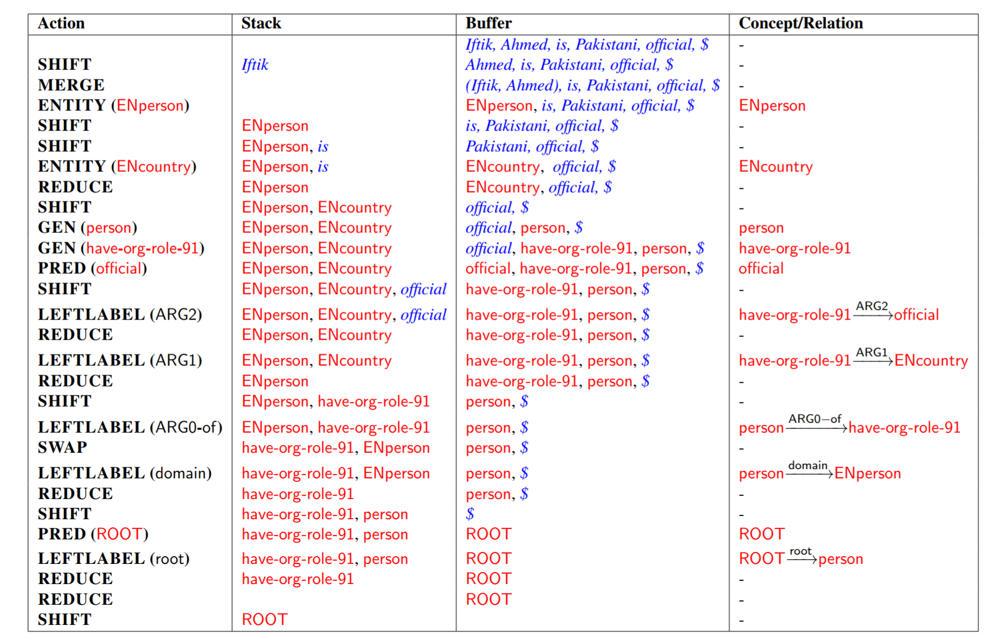

# Better Transition-Based AMR Parsing with a Refined Search Space

[DyNet](https://github.com/clab/dynet) implementation of the transition-based AMR parser. We provide the code for aligner and the parser. You can find all the details in the following paper:

- [ Better Transition-Based AMR Parsing with a Refined Search Space](http://www.statnlp.org/research/sp/zhijiang18emnlp.pdf). (Zhijiang Guo and Wei Lu. EMNLP 2018)

See below for an example for this transition-based AMR parser:



## Requirements

In order to train the parser, you will need to have the following installed:

- Python 3.5.2
- [DyNet 2.0](https://github.com/clab/dynet)
- [JAMR](https://github.com/jflanigan/jamr)
- [MGIZA++](https://github.com/moses-smt/mgiza)
- [NLTK](https://www.nltk.org/)

Notice that we do not support DyNet version higher than 2.0.

### MGIZA++ Installation (Ubuntu)

- Preparation:
```
sudo apt-get install cmake
sudo apt-get install libboost-all-dev
```

- Installing: clone the AMR-Parser first, then put the MGIZA++ inside the data folder
```
cd data
git clone https://github.com/moses-smt/mgiza.git
cd mgiza/mgizapp
cmake .
make
make install
```

### NLTK Tagger Installation

- Installing (under the python3 environment):
```
import nltk
nltk.download('averaged_perceptron_tagger')
nltk.download('wordnet')
```

## Usage 

### Hybrid Aligner
Get the AMR corpus (LDC2014T12/LDC2015E86/LDC2017T10). We can't distribute them because them paid. Put the train/dev/test folder of the corresponding AMR corpus (under the split folder) to the folder /data/amr/data/amrs/split. Then we run the preprocess script. 

- For LDC2014T12 corpus, run the bash script:
```
./preprocess_14.sh
```

- For LDC2015E86, run the bash script:
```
./preprocess_15.sh
```

- For LDC2017T10 corpus, run the bash script:
```
./preprocess_17.sh
```

Aftering running the script, you can find preprocessed AMR files under the amr/tmp_amr folder, which contains train, dev and test three folders. Before using our Hybrid Aligner, we need the output files of [JAMR Aligner](https://github.com/jflanigan/jamr). 

You can get the aligned train file simply by using the JAMR aligner:
```
. scripts/config.sh
scripts/ALIGN.sh < amr.txt > train.txt
```

Then we put three aligned files into one folder called jamr_ouput inside the data folder. Then you can run the bash script of the Hybrid Aligner to get the transition sequences for training the AMR parser:

```
./align.sh
```

Finally, we get four new files: train.transtions, dev.transitions, test.transitions and train.txt.pb.lemmas. train.txt.pb.lemmas is the look-up table for predicate and lemma concept (look at the paper for more details.)

### AMR Parser
Now we are ready for train our own AMR parser.
#### Train a new AMR parser
```
python3 train.py
```

Link to the word vectors that we used in the ACL 2015 paper for English: [sskip.100.vectors](https://drive.google.com/file/d/0B8nESzOdPhLsdWF2S1Ayb1RkTXc/view?usp=sharing). The training process should be stopped when the development SMATCH score does not substantially improve anymore (around epoch 14-16).

#### Parsing with a trained parser

If you want to use a pretrained parser, just put the pretrain model under the result folder. Then run the script (here we use the pretrained model for the AMR2014 corpus as an example):
```
python3 train.py --load_model 1 --model result/pretrain14.model --dev_file data/test.transitions --gold_AMR_dev data/amr/tmp_amr/test/amr.txt 
```

### Related Repo
The code of the unsupervised aligning is adapted from this [repository](https://github.com/melanietosik/string-to-amr-alignment).

### Citation

If you make use of this software, please cite the following:

    @InProceedings{D18-1198,
    author = "Guo, Zhijiang and Lu, Wei",
    title = "Better Transition-Based AMR Parsing with a Refined Search Space",
    booktitle = "Proceedings of the 2018 Conference on Empirical Methods in Natural Language Processing",
    year = "2018"
    }
